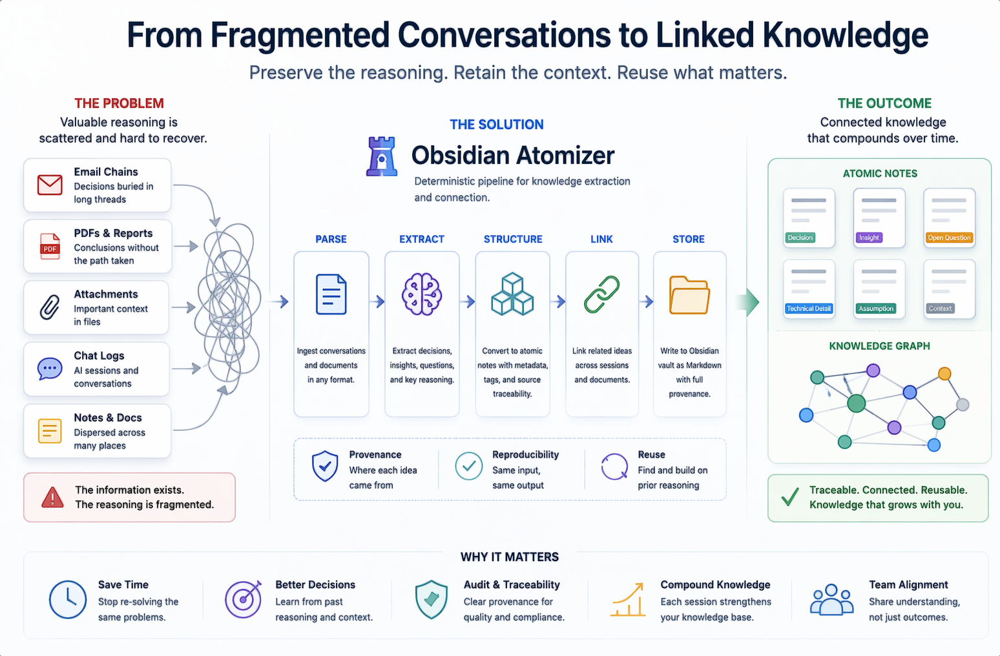
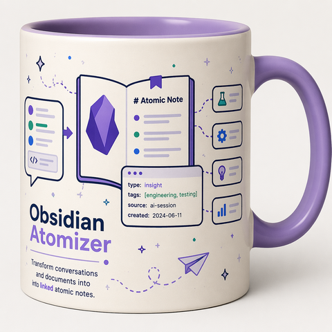

<p align="center">
  
</p>
Turn fragmented conversations into structured, traceable knowledge.

<h1 align="center">Obsidian Atomizer</h1>
Deterministic pipeline for converting fragmented conversations into structured, traceable knowledge.


## License & Usage

This project is source-available for personal and non-commercial use only.

Commercial use requires an explicit license from the author.

For inquiries, contact the repository owner.

<p align="center">
  <strong>Turn any AI conversation, email thread, PDF, or document into linked atomic notes in your Obsidian vault — automatically.</strong>
</p>

<p align="center">
  <a href="#installation">Installation</a> •
  <a href="#quick-start">Quick Start</a> •
  <a href="#features">Features</a> •
  <a href="#supported-formats">Supported Formats</a> •
  <a href="#cli-reference">CLI Reference</a> •
  <a href="#configuration">Configuration</a> •
  <a href="#contributing">Contributing</a>
</p>

<p align="center">
  
  
  
</p>

---

## The Problem

You spend hours in deep AI conversations — designing systems, debugging
code, making decisions, exploring ideas. When the session ends, all that
knowledge is trapped in a chat log you'll never open again.

Your email threads with clients contain critical decisions, technical
judgments, and institutional knowledge — buried under "Hope you're doing
well" and five layers of quoted replies.

Your PDF reports sit in folders, unconnected to anything.

**Obsidian Atomizer fixes this.** One command turns any conversation, email,
or document into clean, linked, tagged atomic notes in your Obsidian vault —
following Zettelkasten principles, with zero manual work.

---

## What It Looks Like

```
$ atomizer --input ./todays-ai-session.md

Optimization report:
  Tokens (raw):    15,234
  Tokens (clean):   8,900  (-41.6%)

Extraction complete:
  Notes created:   12
  Types:           atomic-note: 7, decision: 2, insight: 2, open-question: 1
  Domain:          software

Cross-session links:
  New → Old:       5 links across 3 notes
  Old → New:       3 backlinks injected into existing notes

📦 Archived: todays-ai-session.md
   → archive/2026-06/2026-06-11_001_SWD-INT-AISESS_API-Auth-Design.md

Done. 12 notes in vault. Knowledge compounding.
```

---

## Features

### 🧠 Atomic Extraction
Sends your content to an LLM that extracts one-idea-per-note following
Zettelkasten principles. Each note gets:
- **Typed classification**: `atomic-note`, `decision`, `insight`,
  `open-question`, `artifact`, or `prompt`
- **YAML frontmatter**: domain, tags, confidence level, source tracking
- **Wikilinks**: automatic `[[links]]` between related notes
- **Map of Content**: an index note grouping all extracted atoms by theme

### 📄 7 Input Formats (Auto-Detected)
Drop in any file — the tool figures out the format:

| Format | Extensions | What It Parses |
|--------|-----------|---------------|
| Raw Markdown | `.md` | Speaker turns, headings, code blocks |
| Claude JSON | `.json` | Anthropic's export format, strips tool-use blocks |
| ChatGPT JSON | `.json` | OpenAI's conversations.json, follows active branch |
| Copilot/M365 | `.md` `.txt` | Strips citations, footnotes, AI disclaimers |
| Plain Text | `.txt` | Email exchanges, freeform notes |
| PDF | `.pdf` | Multi-column, tables, headers/footers stripped |
| Word (DOCX) | `.docx` | Headings, bold/italic, tables preserved |

### ⚡ Two-Stage Token Optimization
Reduces what gets sent to the LLM — saving cost and improving quality:

```
Stage 0: Rules-based cleanup (instant, free)
  → Strips boilerplate, signatures, quoted replies, page markers, TOCs
  → Typical savings: 25-35%

Stage 1: Local LLM smart-clean (optional, free via Ollama)
  → Removes pleasantries, meta-commentary, redundant rephrasing
  → Additional savings: 10-20%

Stage 2: Extraction LLM (Sonnet or local)
  → Receives clean, high-signal text only
```

### 🔗 Cross-Session Wikilink Resolution
The killer feature. After extraction, the tool scans your **entire vault**
for concept overlaps and injects bidirectional links:
- New notes automatically link to relevant old notes
- Old notes get backlinks pointing to new notes
- Three matching strategies: title similarity, tag overlap, concept match
- `.bak` backups before modifying any existing file

This is what transforms a filing system into a **knowledge graph**.

### 📦 Auto-Archive with Taxonomy Naming
Input files are automatically renamed and filed using a structured
naming system:

```
{Date}_{Seq}_{Domain}-{Client}-{ContentType}_{Topic}.{ext}

Example:
2026-06-11_001_SWD-INT-AISESS_API-Auth-Design.md
│          │   │   │   │       └─ topic (from content)
│          │   │   │   └─ content type (AI session)
│          │   │   └─ client code (internal)
│          │   └─ domain code (software)
│          └─ sequence number
└─ processing date
```

Sorts chronologically. Self-documenting. Full traceability back to
every atomic note via the manifest.

### 🛡️ Deduplication
SHA-256 hash manifest prevents reprocessing the same file. Tracks
token usage and cost per run. `--force` to intentionally reprocess.

### 🖼️ PDF Image Detection
Image-heavy PDFs (scanned documents, photo reports) are flagged before
any API tokens are spent:

```
⚠ WARNING: This PDF appears to be image-heavy.
  Pages with text: 3 (25%)
  Pages image-only: 9 (75%)

  Proceed anyway? [y/N]:
```

### 🏠 Local-First
Works with Ollama, LM Studio, or any OpenAI-compatible local endpoint.
Run the entire pipeline at **$0 cost** — no API key required.

---

## Installation

### Prerequisites
- Python 3.10+
- An Obsidian vault (or any folder — it just writes `.md` files)
- One of:
  - [Ollama](https://ollama.ai) (recommended, free, local)
  - [LM Studio](https://lmstudio.ai) (free, local, GUI)
  - [Anthropic API](https://console.anthropic.com) (paid, highest quality)

### Install

```bash
pip install obsidian-atomizer
```

Or from source:

```bash
git clone https://github.com/OneEdVenturer/obsidian-atomizer.git
cd obsidian-atomizer
pip install -r requirements.txt
```

### First-Time Setup

```bash
# Interactive setup — creates your config.yaml
atomizer --init

# It will ask:
#   Vault path? ~/ObsidianVault/Atoms/
#   Archive path? ~/ObsidianVault/Archive/
#   LLM provider? (anthropic/local): local
#   Local endpoint? http://localhost:11434/v1
#   Your domain? (engineering/legal/research/business/general): engineering
```

Or copy and edit the example config manually:

```bash
cp config.yaml.example config.yaml
# Edit config.yaml with your paths and taxonomy
```

---

## Quick Start

### Option A: Free (Local LLM via Ollama)

```bash
# 1. Pull a model
ollama pull qwen2.5:14b

# 2. Run
atomizer --input ./my-chat-session.md --provider local

# Done. Check your vault.
```

### Option B: Highest Quality (Anthropic API)

```bash
# 1. Set your API key
export ANTHROPIC_API_KEY="sk-ant-..."  # macOS/Linux
$env:ANTHROPIC_API_KEY = "sk-ant-..."  # Windows PowerShell

# 2. Run
atomizer --input ./my-chat-session.md

# Done. ~$0.10-0.30 per run.
```

### Explore Before Committing

```bash
# Preview format detection (no LLM call, free)
atomizer --input ./my-file.pdf --parse-only

# Preview token optimization (no LLM call, free)
atomizer --input ./my-file.pdf --optimize-only

# Preview extraction without writing files
atomizer --input ./my-file.pdf --dry-run
```

---

## CLI Reference

### Core Commands

```bash
# Process a single file
atomizer --input ./file.md

# Process all files in a directory
atomizer --input-dir ./exports/

# Re-link entire vault (no extraction)
atomizer --cross-link-only

# Check processing history
atomizer --status
```

### Provider Options

```bash
# Use local LLM (Ollama/LM Studio)
atomizer --input ./file.md --provider local

# Use specific model
atomizer --input ./file.md --provider local --model qwen2.5:14b

# Use Anthropic (default if configured)
atomizer --input ./file.md --provider anthropic
atomizer --input ./file.md --model claude-sonnet-4-6
```

### Optimization Options

```bash
# Rules-only optimization (no local LLM needed)
atomizer --input ./file.md --optimize-mode rules

# Rules + local LLM pre-clean (best savings)
atomizer --input ./file.md --optimize-mode both

# Skip optimization entirely
atomizer --input ./file.md --no-optimize
```

### Preview & Safety

```bash
# Dry run — preview everything, write nothing
atomizer --input ./file.md --dry-run

# Parse only — test format detection
atomizer --input ./file.md --parse-only

# Optimize only — see token savings
atomizer --input ./file.md --optimize-only

# Force reprocess (bypass dedup)
atomizer --input ./file.md --force

# Auto-confirm prompts (for scripting)
atomizer --input-dir ./pdfs/ --yes
```

### Feature Toggles

```bash
# Skip cross-session linking
atomizer --input ./file.md --no-cross-link

# Skip archiving
atomizer --input ./file.md --no-archive

# Override input format
atomizer --input ./file.json --format claude-json

# Override session name
atomizer --input ./file.md --session "Q4-Planning-Session"

# Custom output directory
atomizer --input ./file.md --output-dir ~/my-vault/notes/

# Custom config file
atomizer --input ./file.md --config ./my-config.yaml
```

---

## Supported Formats

### Auto-Detection

The tool auto-detects format from file extension and content structure.
Override with `--format` if auto-detection fails.

| Format | Extensions | Auto-Detect Method | Override Flag |
|--------|-----------|-------------------|---------------|
| Claude JSON | `.json` | `uuid` field + `chat_messages` array | `--format claude-json` |
| ChatGPT JSON | `.json` | `mapping` field + `current_node` | `--format chatgpt-json` |
| Markdown | `.md` | Speaker turn patterns (`Human:`, `Assistant:`) | `--format markdown` |
| Copilot | `.md` `.txt` | Citation patterns `[1]`, AI disclaimers | `--format copilot` |
| PDF | `.pdf` | File magic bytes | `--format pdf` |
| DOCX | `.docx` | File magic bytes (ZIP/PK header) | `--format docx` |
| Plain Text | `.txt` | Fallback when no patterns match | `--format plaintext` |

### PDF Notes

- **Multi-column layouts**: detected via vertical-gutter heuristic,
  read left-then-right
- **Tables**: converted to markdown table format
- **Headers/footers**: stripped when repeated across 3+ pages
  (digit-insensitive, so "Page 1 of 3" through "Page 3 of 3" all match)
- **Image-heavy PDFs**: flagged with interactive warning before processing
- **Scanned PDFs**: text extraction only — OCR not included
  (use an OCR tool first, then feed the text output)

### DOCX Notes

- **Headings**: mapped to markdown `#` levels
- **Bold/italic**: converted to `**bold**` and `*italic*`
- **Tables**: converted to markdown tables
- **Images**: skipped with log message ("image skipped at paragraph N")

---

## Configuration

### config.yaml

Copy `config.yaml.example` to `config.yaml` and customize:

```yaml
# === LLM Provider ===
provider: local                            # anthropic | local
model: auto                                # or: qwen2.5:14b, claude-sonnet-4-6
local_endpoint: http://localhost:11434/v1  # Ollama default

# === Output ===
output_dir: ~/ObsidianVault/Atoms/

# === Archive ===
archive_enabled: true
archive_root: ~/ObsidianVault/Archive/

# === Archive Taxonomy (customize these!) ===
archive_taxonomy:
  domains:
    engineering: ENG
    software: SWD
    legal: LAW
    medical: MED
    research: RES
    finance: FIN
    business: BIZ
    general: GEN

  clients:
    # Add your own:
    # acme-corp: ACM
    # globex: GLX
    internal: INT

  content_types:
    plaintext: EMAIL
    markdown: AISESS
    claude-json: AISESS
    chatgpt-json: AISESS
    copilot: AISESS
    pdf: REPORT
    docx: REPORT

# === Optimization ===
optimization:
  enabled: true
  mode: both                              # rules | llm | both
  llm_provider: local
  llm_model: auto
  llm_endpoint: http://localhost:11434/v1
  boilerplate_threshold: 3
  boilerplate_similarity: 0.90
  quoted_reply_similarity: 0.85
  duplicate_turn_similarity: 0.90
  min_token_saving_to_report: 50

# === Cross-Session Linking ===
cross_session_linking:
  enabled: true
  title_similarity_threshold: 0.65
  min_shared_tags: 3
  max_cross_links_per_note: 5
  backup_before_backlink: true
  backup_extension: .bak
```

### Environment Variables

```bash
ANTHROPIC_API_KEY=sk-ant-...    # Required only for anthropic provider
```

### Customizing Extraction Behavior

The system prompt that controls HOW notes are extracted lives in
`templates/system_prompt.md`. Edit this file to:
- Change what counts as an "atomic note"
- Add domain-specific extraction rules
- Adjust the noise/signal threshold
- Modify the YAML frontmatter schema

The optimization prompt lives in `templates/optimizer_prompt.md`.
Edit this to tune what the optimizer considers "noise" vs. "signal"
for your specific domain.

No code changes needed — both prompts are loaded at runtime.

---

## Atomic Note Schema

Every extracted note follows this structure:

```markdown
---
type: atomic-note
source_session: "API-Auth-Review"
source_file: "design-session.md"
source_format: "markdown"
source_domain: "software"
created: "2026-06-11"
confidence: high
tags: [api-design, authentication, oauth, security]
related: ["[[OAuth Token Rotation Strategy]]"]
cross_links: ["[[API Gateway Architecture]]"]
archived_source: "2026-06-11_001_SWD-INT-AISESS_API-Auth-Design.md"
status: active
---

# JWT vs Session-Based Auth Decision

After evaluating both approaches for the internal API, the team
decided to use short-lived JWTs (15-min expiry) with refresh token
rotation...

## Related (Cross-Session)
- [[API Gateway Architecture]] — matched via title similarity (0.72)
- [[Security Audit Checklist]] — matched via shared tags: api-design, security
```

### Note Types

| Type | What It Captures | Example |
|------|-----------------|---------|
| `atomic-note` | A single factual insight or concept | "JWT tokens expire after 15 minutes by default" |
| `decision` | A choice made, with rationale and alternatives rejected | "Chose PostgreSQL over MongoDB because..." |
| `insight` | A realization, pattern, or principle | "Test validity and result applicability are separate questions" |
| `open-question` | Something unresolved that needs follow-up | "Does the auth flow handle offline scenarios?" |
| `artifact` | A reusable prompt, code snippet, or template | A copy/paste-ready deployment script |
| `prompt` | A reusable AI prompt worth preserving | A system prompt that produced good results |

---

## Architecture

```
Input File (.md, .json, .pdf, .docx, .txt)
    │
    ▼
┌──────────────────────┐
│  Format Auto-Detect   │  parsers/__init__.py
│  + Parse to Turns     │  parsers/*.py
└──────────┬───────────┘
           │ [{role, content, timestamp?}, ...]
           ▼
┌──────────────────────┐
│  Token Optimization   │  optimizer.py
│  Rules → Local LLM    │  templates/optimizer_prompt.md
└──────────┬───────────┘
           │ cleaned turns (30-40% fewer tokens)
           ▼
┌──────────────────────┐
│  Chunking (if needed) │  chunker.py
│  Split at turn bounds  │  10-turn overlap
└──────────┬───────────┘
           │
           ▼
┌──────────────────────┐
│  LLM Extraction       │  extractor.py + llm_client.py
│  Sonnet / Local        │  templates/system_prompt.md
└──────────┬───────────┘
           │ raw ATOM_BREAK-delimited output
           ▼
┌──────────────────────┐
│  Split + Parse Notes  │  splitter.py
└──────────┬───────────┘
           │ list of {title, frontmatter, body}
           ▼
┌──────────────────────┐
│  Intra-Batch Linking  │  linker.py
│  + Cross-Session Link │  vault_index.py + cross_linker.py
└──────────┬───────────┘
           │
           ▼
┌──────────────────────┐
│  Write .md Files      │  writer.py
│  + Inject Backlinks   │  (with .bak safety)
└──────────┬───────────┘
           │
           ▼
┌──────────────────────┐
│  Archive Input File   │  archiver.py
│  + Update Manifest    │  .atomizer-manifest.json
└──────────────────────┘
```

---

## Cost Comparison

| Setup | Per Run | Monthly (50 sessions) | Quality |
|-------|---------|----------------------|---------|
| Ollama local, rules optimization | **$0** | **$0** | ⭐⭐⭐ |
| Ollama local, full optimization | **$0** | **$0** | ⭐⭐⭐ |
| Sonnet, rules optimization | ~$0.20 | ~$10 | ⭐⭐⭐⭐ |
| Sonnet, full optimization | ~$0.12 | ~$6 | ⭐⭐⭐⭐⭐ |
| Sonnet, no optimization | ~$0.30 | ~$15 | ⭐⭐⭐⭐ |

---

## Project Structure

```
obsidian-atomizer/
├── atomizer.py              # CLI entry point (argparse)
├── llm_client.py            # Anthropic + local LLM abstraction
├── extractor.py             # Prompt builder, LLM caller, response parser
├── optimizer.py             # Two-stage token optimization
├── parsers/
│   ├── __init__.py          # Auto-detect dispatcher
│   ├── markdown_parser.py   # Raw markdown conversations
│   ├── claude_json_parser.py    # Claude.ai JSON exports
│   ├── chatgpt_json_parser.py   # ChatGPT JSON exports
│   ├── copilot_parser.py    # Microsoft Copilot conversations
│   ├── plaintext_parser.py  # Freeform text, email exchanges
│   ├── pdf_parser.py        # PDF with table/column/image handling
│   └── docx_parser.py       # Word documents
├── splitter.py              # ATOM_BREAK delimiter parser
├── chunker.py               # Large conversation chunking
├── writer.py                # .md file writer with frontmatter
├── linker.py                # Intra-batch wikilink validation
├── vault_index.py           # Existing vault scanner/indexer
├── cross_linker.py          # Cross-session matching + backlinks
├── archiver.py              # Auto-rename and file to archive
├── config.yaml.example      # Configuration template
├── templates/
│   ├── system_prompt.md     # Extraction prompt (editable)
│   └── optimizer_prompt.md  # Optimization prompt (editable)
├── requirements.txt
├── LICENSE
└── README.md
```

---

## FAQ

### Do I need Obsidian?
No. The tool writes standard `.md` files to any folder. Obsidian just
happens to be the best viewer for `[[wikilinks]]` and graph
visualization. You could use any markdown editor.

### What LLMs work?
Any model accessible via the Anthropic API or any OpenAI-compatible
endpoint. Tested with:
- **Anthropic**: Claude Sonnet 4.6, Claude Opus
- **Local (Ollama)**: Qwen 2.5 14B, Llama 3.1 8B/70B, Mistral 7B
- **Local (LM Studio)**: Same models, different interface

### Will it mess up my existing vault?
Cross-session linking creates `.bak` backups before modifying any
existing file. If YAML corruption is detected, the original is
automatically restored. Use `--no-cross-link` to skip vault
modification entirely.

### Can I use it without an API key?
Yes. Use `--provider local` with Ollama or LM Studio. Completely free,
runs on your machine, no data leaves your computer.

### How does it handle large conversations?
Conversations exceeding 80% of the model's context window are
automatically chunked at turn boundaries with 10-turn overlap.
Notes are deduplicated across chunks (>85% title similarity).

### What about privacy?
- **Local mode**: nothing leaves your machine
- **Anthropic mode**: your text is sent to Anthropic's API
  (subject to their [privacy policy](https://www.anthropic.com/privacy))
- **No telemetry**: the tool itself collects zero analytics

---

## Contributing

Contributions are welcome! Some areas where help is needed:

- [ ] **New parsers**: Slack JSON export, Discord export, Notion export
- [ ] **Semantic dedup**: embedding-based duplicate detection across sessions
- [ ] **OCR integration**: for scanned PDFs (Tesseract or similar)
- [ ] **Web UI**: browser-based alternative to CLI
- [ ] **Obsidian plugin**: trigger atomization from within Obsidian
- [ ] **Tests**: always more tests

### Development Setup

```bash
git clone https://github.com/OneEdVenturer/obsidian-atomizer.git
cd obsidian-atomizer
pip install -r requirements.txt
python -m pytest test-fixtures/
```

### Pull Request Guidelines
1. One feature per PR
2. Include tests for new functionality
3. Update README if adding user-facing features
4. Don't break existing tests

---

## Acknowledgments

- [Obsidian](https://obsidian.md) — the vault that makes this worth building
- [Anthropic](https://anthropic.com) — Claude models for extraction
- [Ollama](https://ollama.ai) — making local LLMs accessible
- [pdfplumber](https://github.com/jsvine/pdfplumber) — PDF text extraction
- [python-docx](https://github.com/python-openxml/python-docx) — DOCX parsing
- [Zettelkasten.de](https://zettelkasten.de/) — the philosophy behind atomic notes
- Niklas Luhmann — for proving that 90,000 linked notes can produce 70 books

---

## License

[MIT](LICENSE) — use it, fork it, build on it.

---

<p align="center">
  <strong>Stop losing knowledge to chat logs.</strong><br/>
  <code>pip install obsidian-atomizer</code>
</p>
